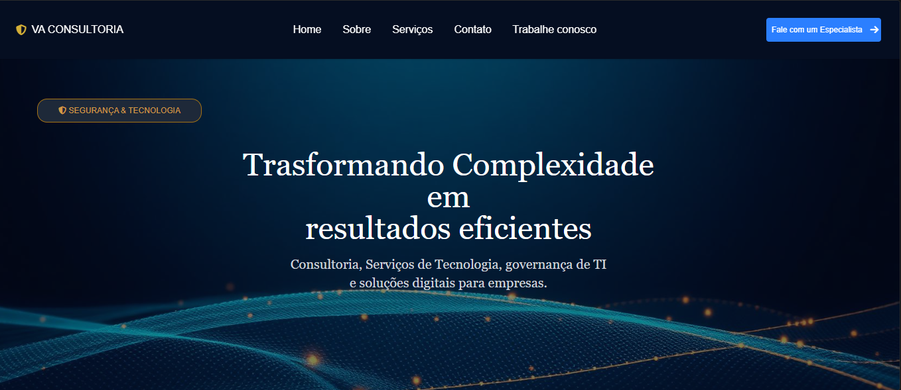

# 🛡️ InfoSec Consulting - Site Institucional

Landing page e plataforma institucional desenvolvida para uma empresa de consultoria em Segurança da Informação, com foco em alta conversão de leads, apresentação clara de serviços de cibersegurança e experiência responsiva.

🔗 **Link do Projeto Online (Live Demo):** [Acessar Projeto](https://info-sec-consulting.vercel.app/)

---

## 📸 Demonstração



---

## ✨ Funcionalidades

- **Apresentação de Serviços:** Seções dedicadas a Pentest, Conformidade (LGPD/ISO 27001) e Auditoria de Segurança.
- **Captação de Leads:** Formulário de contato para orçamento com validação de campos.
- **Design Responsivo:** Interface adaptada para smartphones, tablets e desktops.
- **Performance & SEO:** Estrutura otimizada para rápido carregamento e boa indexação.

---

## 🛠️ Tecnologias Utilizadas

- **Front-end:** React.js, Tailwind CSS (ou Styled-Components)
- **Ícones & Componentes:** Lucide React / React Icons / font awesome
- **Build Tool:** Vite / Create React App
- **Deploy:** Vercel

---

## 🚀 Como Executar o Projeto Localmente

1. Clone este repositório:
   ```bash
   git clone [https://github.com/venilsongomes/InfoSec-Consulting.git](https://github.com/venilsongomes/InfoSec-Consulting.git)


2. Acesse a pasta do projeto:
    cd Consultoria

3. Instale as dependências:
    npm install
    
4. Inicie o servidor de desenvolvimento:
    npm run dev

    Desenvolvido por Venillson Gomes 🚀